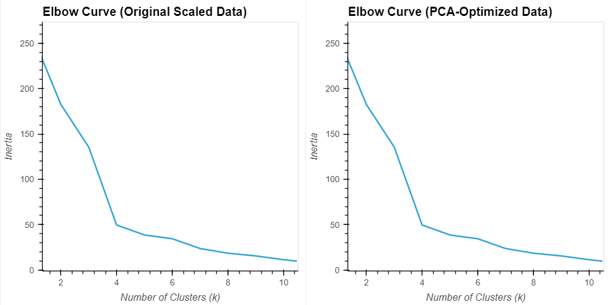
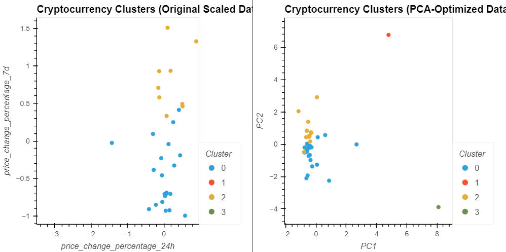

# CryptoClustering
Python and unsupervised learning was used to predict if cryptocurrencies are affected by 24-hour or 7-day price changes. The goal of this analysis was to cluster cryptocurrencies based on their market performance using K-Means clustering. The analysis was conducted before and after applying Principal Component Analysis (PCA) to compare the impact of dimensionality reduction.

The dataset contained price change % for a number of cryptocurrencies over varying time periods. First the StandardScaler module from scikit-learn was used to standardize the data and ensure fair clustering. After creating a Pandas dataframe and setting the coin-id as the index, the Elbow Method was used to find the best value for k. The range of k values was defined from 1-12 and a for loop was used to create a KMeans model and subsequently calculate the inertia values.

The resulting Elbow Curve indicated an optimal k value of 4. Next the kmeans.predict function was used to predict the clusters to group the cryptocurrencies in the dataframe. Subsequently the clusters were plotted on a scatterplot using the hv.plot funciton, to highlight the 24hr vs 7 day price change percentages.

Next, the same steps were repeated using a Principal Component Analysis (PCA). A PCA model with the pca.fit_transform function was used to reduce the original dataset to 3 principal components: PC1, PC2 and PC3.

The pca.explained_variance_ratio_ function was used to calculate the explained variance of our three principal components. This totaled to approximately 0.895, indicating that 89.5% of the dataset's variance is captured just by our three principal components. After all the remaining steps were repeated with the PCA, the following comparable findings were gathered:

We can clearly see when comparing the Elbow Curves from both the original dataset and the PCA method that they indicate an optimal k value of 4. However the clusters mapped on the scatterplot seem to be more concentrated in the PCA analysis and the red and green clusters are better separated compared to the original data. Therefore, cluster separation seems to have improved in the PCA method. This indicates the comparable diversity of the data, and the clustering of our data has been carried out in an effective and impactful manner.

Therefore we can conclude that the PCA method reduced white noise and improved model efficieny, facilitating the analysis of the clusters. However its also possible that some details were lost, as the PCA components are a bit more condensed and do not have the exact empirical weight such as daily or weekly price percentage changes.